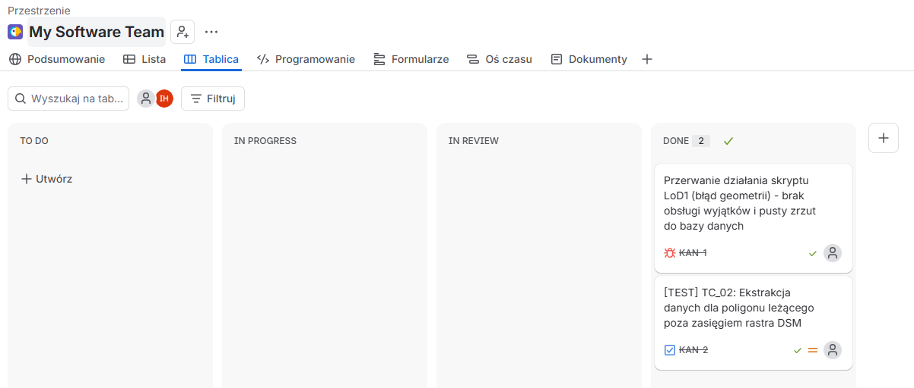
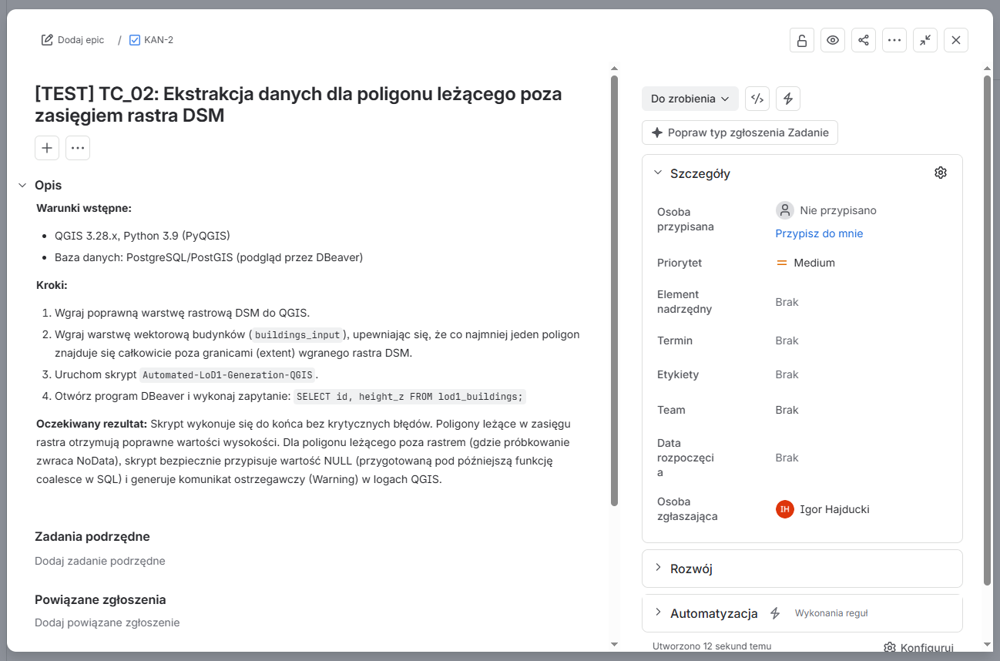
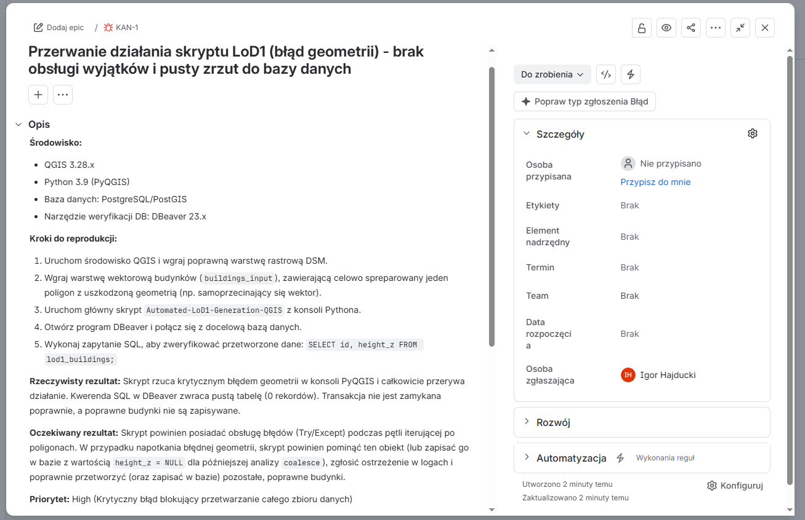
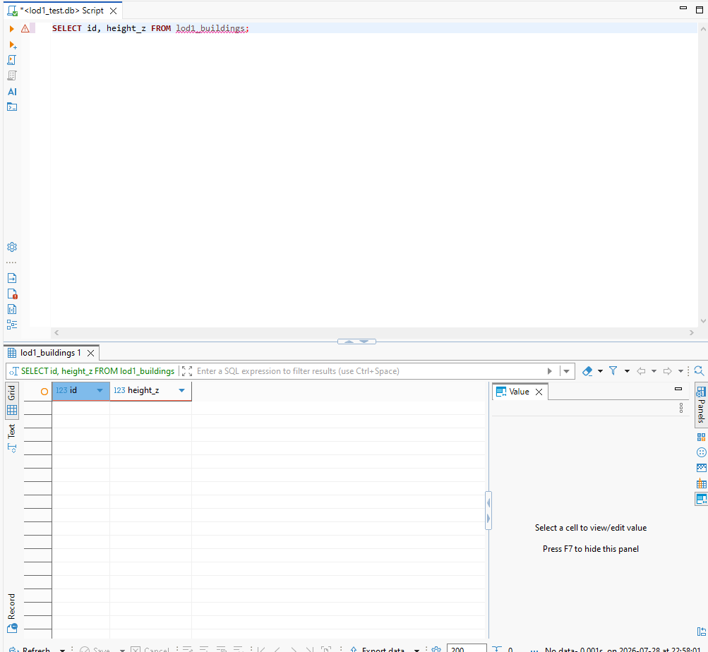
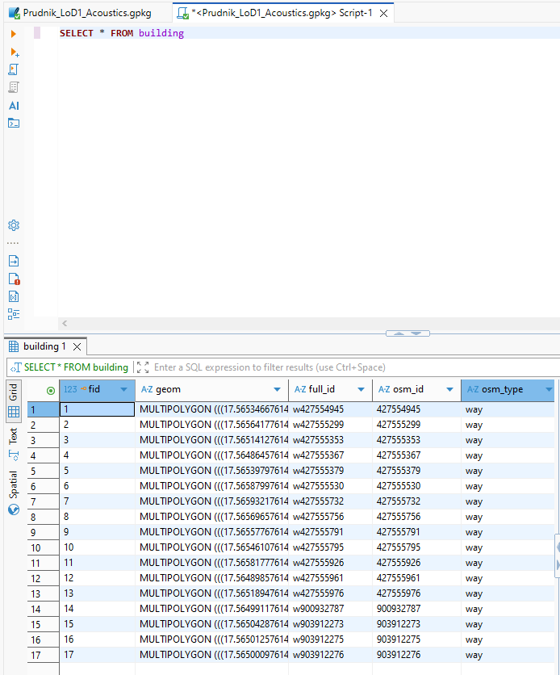
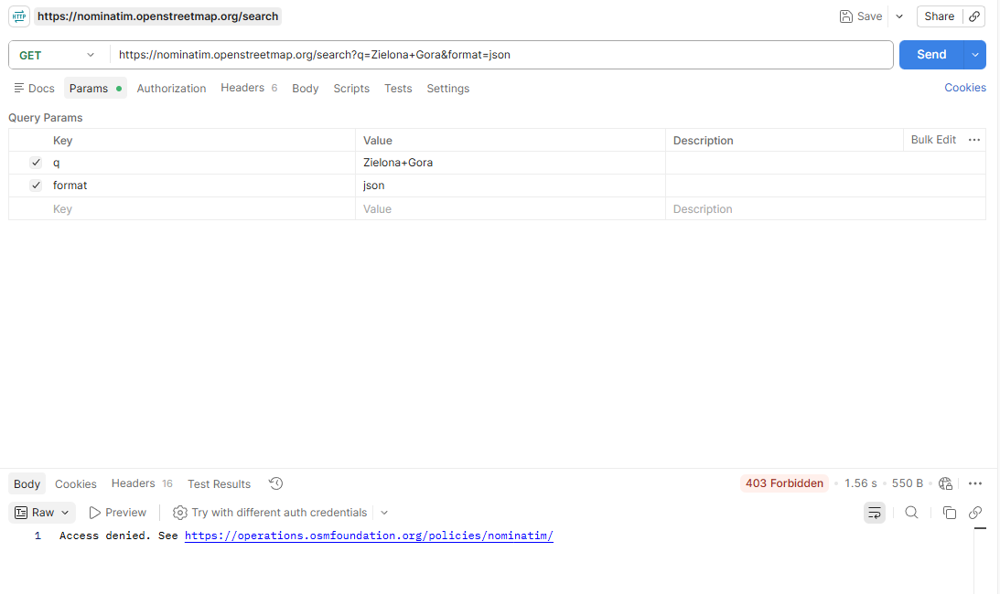
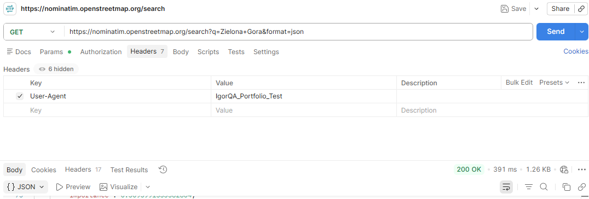

# Portfolio QA – Analiza Przestrzenna, Testy Bazodanowe i API

Niniejsze repozytorium zawiera dokumentację procesu testowego, demonstrującą pełen cykl życia defektu (Bug Life Cycle), tworzenie przypadków testowych, weryfikację integralności danych bezpośrednio w bazie oraz testowanie komunikacji API. 

Projekt stanowi potwierdzenie umiejętności wymaganych na stanowisku Testera Oprogramowania, w tym analitycznego myślenia, pracy z bazami danych oraz narzędziami do testów API.

---

##  Wykorzystane Narzędzia i Technologie
*   **Zarządzanie testami i defektami:** Jira (Kanban, Bug Reporting, Test Case Design)
*   **Backend / Bazy danych:** DBeaver, SQLite / GeoPackage (zapytania SQL, walidacja struktury danych)
*   **Testowanie API (REST):** Postman (obsługa nagłówków HTTP, weryfikacja statusów 200/403, walidacja formatu JSON)

---

##  Dokumentacja Procesu Testowego

### 1. Cykl Życia Zgłoszenia (Jira Kanban)
Praca zorganizowana w oparciu o tablicę Kanban. Poniższy zrzut ekranu prezentuje stan po zakończonym procesie testowym – pomyślnie zamknięty raport błędu (KAN-1) oraz zintegrowany przypadek testowy (KAN-2) w kolumnie "DONE".

### 2. Projektowanie Przypadków Testowych (Test Design)
Szczegółowy przypadek testowy (TC_02) weryfikujący zachowanie skryptu w sytuacjach brzegowych (Edge Cases), takich jak brak pokrycia rastra dla analizowanego wektora.

### 3. Raportowanie Błędów (Bug Report)
Zgłoszenie błędu krytycznego (KAN-1). Raport zawiera jasne kroki do reprodukcji, specyfikację środowiska oraz precyzyjne zestawienie wyniku rzeczywistego z oczekiwanym.

### 4. Weryfikacja Backendowa i Retesty (DBeaver)
Weryfikacja operacji bazodanowych (podejście szarej skrzynki / grey-box testing). 
*   **Stan awarii:** Potwierdzenie błędu w systemie – przerwanie działania skryptu skutkuje niezamkniętą transakcją i pustą tabelą (0 rekordów).
    
*   **Retest (Sukces):** Walidacja poprawki deweloperskiej. Prawidłowe wykonanie zapytania `SELECT` udowadnia, że geometria obiektów (typ `MULTIPOLYGON`) poprawnie zapisała się w docelowej tabeli `building`.
    

### 5. Testowanie Komunikacji i API (Postman)
Weryfikacja zewnętrznych endpointów systemowych przy użyciu metody GET.
*   **Obsługa zabezpieczeń i wyjątków:** Weryfikacja odpowiedzi serwera przy braku odpowiednich uprawnień klienta (odrzucenie żądania ze statusem `403 Forbidden`).
    
*   **Pozytywny test komunikacji:** Ominięcie zabezpieczeń serwera poprzez wstrzyknięcie niestandardowego nagłówka HTTP (`User-Agent`). Serwer poprawnie autoryzuje żądanie i zwraca oczekiwane dane w formacie JSON ze statusem `200 OK`.
    

---
*Autor: Igor Hajducki*
