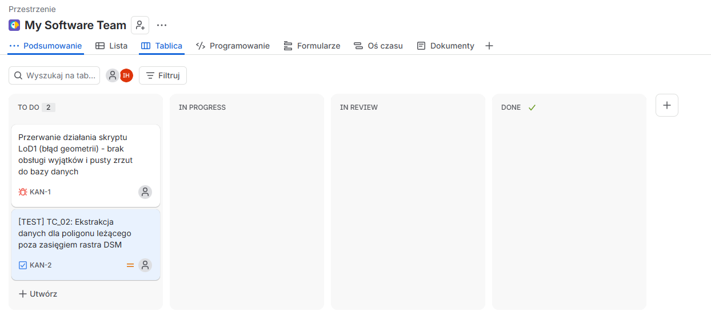
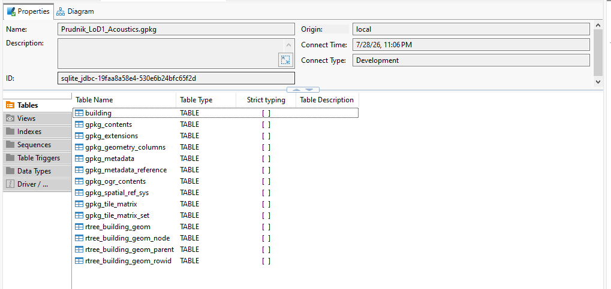

# Portfolio QA – Analiza Przestrzenna i Testy Bazodanowe

Niniejsze repozytorium zawiera dokumentację procesu testowego dla skryptu generującego modele budynków LoD1. Projekt demonstruje pełen cykl życia defektu (Bug Life Cycle), tworzenie przypadków testowych oraz weryfikację integralności danych bezpośrednio w bazie przestrzennej.

---

##  Wykorzystane Narzędzia
*   **Zarządzanie testami:** Jira (Kanban, Bug Reporting, Test Case Design)
*   **Backend / Bazy danych:** DBeaver, SQLite, PostGIS
*   **Środowisko testowe:** QGIS 3.28.x, Python 3.9 (PyQGIS)

---

##  Dokumentacja Procesu Testowego

### 1. Zarządzanie Zgłoszeniami (Jira Kanban)
Praca zorganizowana została w oparciu o metodykę zwinną. Poniżej znajduje się widok tablicy z przygotowanym przypadkiem testowym oraz zgłoszonym defektem oczekującym na podjęcie przez dewelopera.

### 2. Projektowanie Przypadków Testowych (Test Design)
Szczegółowy przypadek testowy (TC_02) weryfikujący zachowanie algorytmu w sytuacjach brzegowych (Edge Cases), takich jak brak pokrycia rastra dla wektora.

### 3. Raportowanie Błędów (Bug Report)
Zgłoszenie krytycznego błędu (KAN-1) blokującego działanie skryptu. Raport zawiera jasne kroki do reprodukcji, środowisko testowe oraz zestawienie wyniku rzeczywistego z oczekiwanym.

### 4. Weryfikacja Backendowa – Stan Awarii (DBeaver)
Dowód na to, że w wyniku braku obsługi wyjątków w kodzie (błąd KAN-1), transakcja bazodanowa nie jest zamykana poprawnie, a tabela w bazie pozostaje pusta (0 rekordów).

### 5. Struktura Docelowej Bazy Danych
Podgląd prawidłowo podłączonego środowiska przestrzennego (GeoPackage), na którym weryfikowana jest ostateczna struktura tabeli `building` po nałożeniu poprawek przez zespół programistyczny.

---
*Autor: Igor Hajducki*
